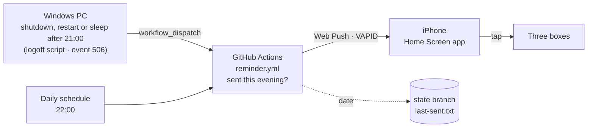

<div align="center">


# Akşam Notu

**A tiny evening note and reminder app. When the computer shuts down or goes to sleep at night, the phone gets one gentle reminder to write three lines before bed.**

*Akşam Notu is Turkish for "evening note". A companion app to [İçgörü](https://github.com/YILDIRIMZX/Piskolojik-Destek-Uygulamas-).*

**English** · [Türkçe](README.tr.md) · [Русский](README.ru.md)


</div>

## What it is

Akşam Notu turns a short evening check-in into a habit that costs a minute or two: before bed, write down the problem that is still open, the first step for tomorrow, and whether today's "alarm" went off (a recurring self-critical sentence). The next morning, the app shows last night's note first.

It is deliberately quiet. There are **no streaks, scores, warnings or guilt-inducing messages**. Every box may be left empty. The reminder comes **at most once a day** and can be dismissed like any notification.

> Every update, with what changed and why, is listed in [CHANGELOG.md](CHANGELOG.md).

## How the reminder works



1. **Shutdown and sleep trigger.** Windows does not always log a shutdown event, and the last second before power-off is too short for a network request. So shutdown and restart are caught by a **logoff script** (local Group Policy): Windows runs it on every shutdown and restart and waits for it to finish. Sleep is caught by a scheduled task that listens for event 506 (entering Modern Standby), but only when the user starts it: closing the lid, the power or sleep button, or Start > Sleep. The screen turning off after idle time does not count. If it is after 21:00, the script calls the GitHub API once (about a second) and sends **the computer's local time with its UTC offset** (for example `2026-10-09T23:19:30+03:00`). GitHub decides by that time, not by when the request arrives, and ignores a request that is more than 90 minutes old.
2. **One sender.** All reminders are sent by a single GitHub Actions workflow. It checks the date stored on a separate `state` branch and only sends if nothing was sent this evening. Runs are serialized, so a shutdown and the 22:00 run can never both send.
3. **22:00 safety net.** The workflow also runs on a schedule. If no reminder went out by 22:00 (for example, the computer was never switched on), it sends one. GitHub can start scheduled runs very late, sometimes hours, so there are three runs (21:40, 22:00, 22:20) and a scheduled run only sends between 22:00 and 23:30. A run that starts later does nothing, so a reminder never arrives in the middle of the night.
4. **Web Push straight to the app.** The notification is a standard Web Push message signed with VAPID keys. Tapping it opens the note screen. A late-night evening lasts until 05:00, so a shutdown at 00:30 still counts for the day before.

## Features

| Area | What it does |
|---|---|
| **Three boxes** | Open problem · First step tomorrow · Did the alarm go off today (yes / no, with an optional sentence). All optional. |
| **Morning view** | Between 05:00 and 17:00, last night's note is shown at the top. |
| **History** | Every note, stored by date, newest first. Empty boxes are left out. |
| **Reminder** | **Yatmadan önce üç satır** · Açıkta kalan problem, yarın atacağım ilk adım, bugün alarm çaldı mı? At most once per evening. |
| **Backup and delete** | One-tap JSON export. All notes can be deleted from the device with a two-tap confirmation. |

## Privacy and security

- **Notes never leave the device.** They are stored in the browser's IndexedDB. Nothing is uploaded, not even to GitHub. The app asks the browser for persistent storage so that notes are not cleared under storage pressure.
- **The app cannot send data anywhere.** The published page carries a Content Security Policy that allows connections only to its own address, and there are no third-party scripts, fonts or analytics. Even a faulty dependency could not send notes to another server. Links are opened without a referrer.
- **You stay in control.** All notes can be deleted in the app with a two-tap confirmation. The backup file is not encrypted, so store it with care.
- **The reminder carries no personal data.** The push payload is a fixed sentence from `push.config.json`. GitHub only stores the date of the last reminder.
- **Only you can send notifications to your phone.** Sending needs both the VAPID private key and the phone's subscription. Both are encrypted GitHub Actions secrets: they are never shown in logs and are not available to forks or pull requests. Starting the workflow needs write access to the repository. A notification can only show text; it cannot read anything from the phone.
- **The Windows token is narrow.** It is a fine-grained token limited to this repository and to Actions. It is stored in the user's own profile, encrypted with Windows DPAPI so that only that Windows account can decrypt it. The logoff script itself lives in a folder that only administrators can change.
- **What is public.** In a public repository anyone can see when the reminder workflow ran, which roughly shows when the computer was shut down. Logs only say what was decided, never who triggered it. To hide the timing as well, run the reminder workflow from a private repository (the free Actions minutes are enough).
- **Protect the GitHub account.** Whoever controls the account could change the app's code, so turn on two-factor authentication.

## Setup

You need a GitHub account, an iPhone with iOS 16.4 or later (or any browser with Web Push), and Windows 10 or 11 for the shutdown trigger.

1. **Repository and Pages.** Create a public repository, push this project, then set **Settings > Pages > Source** to **GitHub Actions**.
2. **VAPID keys.** Run `npx web-push generate-vapid-keys`. Put the public key and your `owner/repo` into [`push.config.json`](push.config.json), and save the private key as the Actions secret **`VAPID_PRIVATE_KEY`** (**Settings > Secrets and variables > Actions**).
3. **Phone.** Open the site in Safari, choose **Share > Add to Home Screen**, open the app from the Home Screen, go to **Bildirim** and tap **Bildirimleri aç**. Copy the code it shows and save it as the secret **`PUSH_SUBSCRIPTIONS`**. To add more devices, combine their codes into a JSON array.
4. **Token.** Create a [fine-grained personal access token](https://github.com/settings/personal-access-tokens/new) with access to this repository only and the permission **Actions: Read and write**.
5. **Windows.** Run `pc\kur.ps1` (it asks for administrator rights; the administrator must be the same account you use), paste the token when asked, and send a test notification. It also upgrades an earlier installation and keeps its token. `pc\kaldir.ps1` removes everything again.
6. **Optional.** Set the Actions variable `START_HOUR` to change 21:00. You can also start **Actions > Evening reminder > Run workflow** with "test" checked to send a reminder at any time.

## Tech stack

| Layer | Technology | Version |
|---|---|---|
| UI | React | 19.3 |
| Language | TypeScript | 6.0 |
| Build | Vite | 8.3 |
| Styling | Tailwind CSS (Vite plugin) | 4.3 |
| Icons | Phosphor Icons | 2.1 |
| Typeface | Geist Variable (self-hosted via Fontsource) | 5.3 |
| PWA | vite-plugin-pwa (Workbox, injectManifest) | 2.0 |
| Storage | idb-keyval (IndexedDB) | 6.3 |
| Push | Web Push API, `web-push` (VAPID) | 3.6 |
| Scheduler and sender | GitHub Actions | |
| Shutdown trigger | Windows Task Scheduler, PowerShell 5.1 | |
| Hosting | GitHub Pages | |

## Project structure

```
src/
├── App.tsx                 View switch, evening rollover at 05:00
├── sw.ts                   Service worker: offline cache, push, notification tap
├── screens/
│   ├── Today.tsx           Last night's note and the three boxes
│   ├── History.tsx         All notes by date
│   ├── Settings.tsx        Notification setup and backup
│   └── NoteView.tsx        Read-only note
└── lib/
    ├── notes.ts            Storage, evening date logic, backup
    └── push.ts             Permission, subscription, test notification
.github/
├── workflows/reminder.yml  Once-per-evening sender (shutdown, 22:00, manual)
├── workflows/deploy.yml    Build and publish to Pages
└── push/send.mjs           Web Push sender
pc/
├── kur.ps1                 Windows setup (task, encrypted token)
├── kapanis.ps1             Logoff script and sleep task, sends the local time to GitHub
└── kaldir.ps1              Uninstall
push.config.json            Repository name and VAPID public key
```

## Limitations

- **Sleep needs Modern Standby.** Most current laptops use it (check with `powercfg /a`, look for "S0 Low Power Idle"). On older machines with classic S3 sleep only shutdown and restart count. A restart after 21:00 also triggers the reminder, an idle screen-off does not.
- **Delays and missed evenings.** A shutdown reminder usually arrives within 10-60 seconds. If GitHub starts all three scheduled runs after 23:30, the 22:00 reminder is skipped that evening rather than sent at night.
- **Inactive repositories.** GitHub pauses scheduled workflows in public repositories after 60 days without activity. The daily update of the `state` branch normally keeps it active. If reminders stop, re-enable the workflow in the Actions tab.
- **One device, one set of notes.** Notes are not synced between phone and computer.
- **Expired subscriptions.** If iOS drops the subscription (for example after removing the app), the workflow reports it. Turn notifications off and on in the app and paste the new code.

## Roadmap

- **Version 2: phone trigger.** If the computer was not used in the evening but the phone is in use after a set hour, send the same reminder once. Planned with an iOS Shortcuts automation that calls the same workflow with `source: phone`, so the once-a-day rule still holds.

## License

Released under the [MIT License](LICENSE). Copyright (c) 2026 Yıldırım Öztürk.
