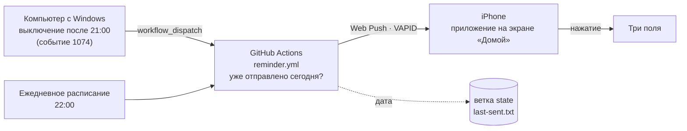

# Akşam Notu

**Маленькое приложение для вечерних заметок и напоминаний. Когда вечером выключается компьютер, на телефон приходит одно мягкое напоминание написать три строки перед сном.**

*Akşam Notu по-турецки означает «вечерняя заметка». Приложение-компаньон к [İçgörü](https://github.com/YILDIRIMZX/Piskolojik-Destek-Uygulamas-).*

[English](README.md) · [Türkçe](README.tr.md) · **Русский**

## Что это

Akşam Notu превращает одно упражнение между сессиями в привычку на минуту-две: перед сном записать нерешённую проблему, первый шаг на завтра и то, сработал ли сегодня «будильник» (повторяющаяся самокритичная фраза). Утром приложение первым показывает вчерашнюю заметку.

Оно намеренно тихое. **Нет серий, баллов, предупреждений и обвиняющих сообщений.** Любое поле можно оставить пустым. Напоминание приходит **не чаще одного раза в день** и закрывается как обычное уведомление.

> Все обновления с описанием того, что и почему изменилось, перечислены в [CHANGELOG.md](CHANGELOG.md).

## Как работает напоминание

1. **Выключение компьютера.** Задача планировщика Windows отслеживает событие 1074, которое Windows записывает в начале выключения или перезагрузки. Если уже позже 21:00, она один раз обращается к API GitHub (около секунды) и запускает workflow напоминания.
2. **Один отправитель.** Все напоминания отправляет один workflow GitHub Actions. Он сверяется с датой на отдельной ветке `state` и отправляет, только если сегодня вечером ещё ничего не уходило. Запуски идут по очереди, поэтому выключение и запуск в 22:00 никогда не отправят оба.
3. **Подстраховка в 22:00.** Workflow также запускается по расписанию. Если к 22:00 напоминания не было (например, компьютер не включали), оно отправляется тогда. Запуски по расписанию на GitHub часто стартуют с опозданием, поэтому он стартует в 21:40 и сам ждёт 22:00.
4. **Web Push прямо в приложение.** Уведомление — стандартное сообщение Web Push, подписанное ключами VAPID. Нажатие открывает экран заметки. Вечер длится до 05:00, поэтому выключение в 00:30 засчитывается предыдущему дню.

## Возможности

| Раздел | Что делает |
|---|---|
| **Три поля** | Нерешённая проблема · Первый шаг завтра · Сработал ли сегодня будильник (да / нет, с необязательной фразой). Всё необязательно. |
| **Утренний вид** | С 05:00 до 17:00 вчерашняя заметка показывается сверху. |
| **История** | Все заметки по датам, новые сверху. Пустые поля не показываются. |
| **Напоминание** | «Yatmadan önce üç satır: açıkta kalan problem, yarın atacağım ilk adım, bugün alarm çaldı mı.» Не чаще одного раза за вечер. |
| **Резервная копия** | Экспорт в JSON одним нажатием. |

## Конфиденциальность

- **Заметки не покидают устройство.** Они хранятся в IndexedDB браузера и никуда не загружаются, даже на GitHub.
- **Напоминание не содержит личных данных.** Текст уведомления фиксированный. GitHub хранит только дату последнего напоминания.
- **Секреты остаются секретами.** Закрытый ключ VAPID и подписка на уведомления хранятся как секреты GitHub Actions. Токен на Windows — fine-grained токен, ограниченный этим репозиторием и Actions; он зашифрован через Windows DPAPI и лежит в папке, доступной только SYSTEM и администраторам.

## Установка

Нужны аккаунт GitHub, iPhone с iOS 16.4 или новее (или любой браузер с Web Push) и Windows 10 или 11 для срабатывания при выключении.

1. **Репозиторий и Pages.** Создайте публичный репозиторий, отправьте проект и выберите **Settings > Pages > Source: GitHub Actions**.
2. **Ключи VAPID.** Выполните `npx web-push generate-vapid-keys`. Впишите открытый ключ и `владелец/репозиторий` в [`push.config.json`](push.config.json), а закрытый ключ сохраните как секрет Actions **`VAPID_PRIVATE_KEY`** (**Settings > Secrets and variables > Actions**).
3. **Телефон.** Откройте сайт в Safari, выберите **Поделиться > На экран «Домой»**, откройте приложение с экрана «Домой», зайдите в **Bildirim** и нажмите **Bildirimleri aç**. Скопируйте показанный код и сохраните его как секрет **`PUSH_SUBSCRIPTIONS`**. Для нескольких устройств объедините коды в JSON-массив.
4. **Токен.** Создайте [fine-grained personal access token](https://github.com/settings/personal-access-tokens/new) с доступом только к этому репозиторию и правом **Actions: Read and write**.
5. **Windows.** Запустите `pc\kur.ps1` (запросит права администратора), вставьте токен и отправьте тестовое уведомление. `pc\kaldir.ps1` всё удаляет.
6. **Дополнительно.** Переменная Actions `START_HOUR` меняет 21:00. Через **Actions > Evening reminder > Run workflow** с отметкой «test» можно отправить напоминание в любой момент.

## Технологии

| Слой | Технология | Версия |
|---|---|---|
| Интерфейс | React | 19.3 |
| Язык | TypeScript | 6.0 |
| Сборка | Vite | 8.3 |
| Стили | Tailwind CSS (плагин Vite) | 4.3 |
| Иконки | Phosphor Icons | 2.1 |
| Шрифт | Geist Variable (через Fontsource) | 5.3 |
| PWA | vite-plugin-pwa (Workbox, injectManifest) | 2.0 |
| Хранилище | idb-keyval (IndexedDB) | 6.3 |
| Уведомления | Web Push API, `web-push` (VAPID) | 3.6 |
| Планировщик и отправка | GitHub Actions | |
| Срабатывание при выключении | Планировщик заданий Windows, PowerShell 5.1 | |
| Хостинг | GitHub Pages | |

## Ограничения

- **Сон и гибернация не учитываются.** Событие 1074 появляется только при настоящем выключении или перезагрузке. Перезагрузка после 21:00 тоже вызывает напоминание.
- **Задержки.** Напоминание при выключении обычно приходит за 10-60 секунд. В загруженные дни GitHub может запускать задачи по расписанию с опозданием, поэтому напоминание в 22:00 иногда задерживается на несколько минут.
- **Неактивные репозитории.** GitHub приостанавливает задачи по расписанию в публичных репозиториях после 60 дней без активности. Ежедневное обновление ветки `state` обычно это предотвращает. Если напоминания прекратились, включите workflow снова на вкладке Actions.
- **Одно устройство — один набор заметок.** Заметки не синхронизируются между телефоном и компьютером.
- **Устаревшие подписки.** Если iOS сбрасывает подписку (например, после удаления приложения), workflow сообщает об этом. Выключите и снова включите уведомления в приложении и вставьте новый код.

## Планы

- **Версия 2: срабатывание от телефона.** Если вечером компьютером не пользовались, но телефон активен после заданного часа, отправить то же напоминание один раз. Планируется через автоматизацию iOS «Команды», которая вызывает тот же workflow с `source: phone`, так что правило «раз в день» сохраняется.

## Лицензия

Распространяется по [лицензии MIT](LICENSE). Copyright (c) 2026 Yıldırım Öztürk.
