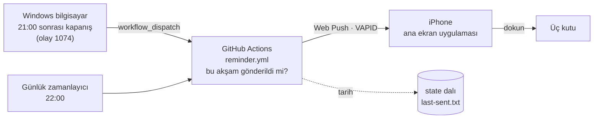

<div align="center">


# Akşam Notu

**Küçük bir akşam notu ve hatırlatma uygulaması. Bilgisayar gece kapanınca telefona, yatmadan önce üç satır yazmayı hatırlatan tek bir nazik bildirim gelir.**

*[İçgörü](https://github.com/YILDIRIMZX/Piskolojik-Destek-Uygulamas-)'nün yardımcı uygulamasıdır.*

[English](README.md) · **Türkçe** · [Русский](README.ru.md)


</div>

## Nedir

Akşam Notu, seanslar arası bir ödevi bir iki dakikalık bir alışkanlığa dönüştürür: yatmadan önce açıkta kalan problemi, yarın atılacak ilk adımı ve bugün "alarmın" (tekrarlayan öz eleştirel bir cümle) çalıp çalmadığını yazarsın. Ertesi sabah uygulama önce dün akşamki notu gösterir.

Bilerek sessiz tasarlandı. **Seri tutma, puan, uyarı ya da suçlayıcı mesaj yoktur.** Her kutu boş bırakılabilir. Hatırlatma **günde en fazla bir kez** gelir ve her bildirim gibi kapatılabilir.

> Her güncelleme, neyin neden değiştiğiyle birlikte [CHANGELOG.md](CHANGELOG.md) dosyasında yer alır.

## Hatırlatma nasıl çalışır



1. **Kapanış tetikleyicisi.** Bir Windows zamanlanmış görevi, Windows'un kapatma ya da yeniden başlatma başlarken yazdığı 1074 olayını dinler. Saat 21:00'i geçtiyse GitHub API'sine tek bir istek atar (yaklaşık bir saniye) ve hatırlatma işini başlatır.
2. **Tek gönderici.** Tüm hatırlatmaları tek bir GitHub Actions işi gönderir. İş, ayrı bir `state` dalında tutulan tarihe bakar ve yalnızca bu akşam henüz gönderilmediyse gönderir. Çalışmalar sırayla yürür, bu yüzden bir kapanış ile 22:00 çalışması asla ikisi birden göndermez.
3. **22:00 güvencesi.** İş her gün belirli bir saatte de çalışır. 22:00'ye kadar hatırlatma gitmediyse (örneğin bilgisayar hiç açılmadıysa) o zaman gönderir. GitHub'ın zamanlanmış işleri sık sık geç başladığından iş 21:40'ta başlar ve 22:00'yi kendisi bekler.
4. **Doğrudan uygulamaya Web Push.** Bildirim, VAPID anahtarlarıyla imzalanmış standart bir Web Push mesajıdır. Dokununca not ekranı açılır. Bir akşam 05:00'e kadar sürer, yani 00:30'daki kapanış bir önceki güne sayılır.

## Özellikler

| Alan | Ne yapar |
|---|---|
| **Üç kutu** | Açıkta kalan problem · Yarın atacağım ilk adım · Bugün alarm çaldı mı (evet / hayır, isteğe bağlı cümleyle). Hepsi isteğe bağlı. |
| **Sabah görünümü** | 05:00 ile 17:00 arasında dün akşamki not en üstte gösterilir. |
| **Geçmiş** | Tüm notlar tarihe göre, en yenisi üstte. Boş kutular gösterilmez. |
| **Hatırlatma** | "Yatmadan önce üç satır: açıkta kalan problem, yarın atacağım ilk adım, bugün alarm çaldı mı." Akşam başına en fazla bir kez. |
| **Yedek** | Tek dokunuşla JSON dışa aktarma. |

## Gizlilik

- **Notlar cihazdan çıkmaz.** Tarayıcının IndexedDB'sinde saklanır. Hiçbir yere, GitHub'a bile yüklenmez.
- **Hatırlatma kişisel veri taşımaz.** Bildirim içeriği sabit bir cümledir. GitHub yalnızca son hatırlatmanın tarihini tutar.
- **Gizli bilgiler gizli kalır.** VAPID özel anahtarı ve bildirim aboneliği GitHub Actions gizli değerleridir. Windows'taki anahtar yalnızca bu repoya ve Actions'a yetkili, ince ayarlı bir token'dır; Windows DPAPI ile şifrelenip yalnızca SYSTEM ve yöneticilerin okuyabildiği bir klasörde saklanır.

## Kurulum

Bir GitHub hesabı, iOS 16.4 veya üstü bir iPhone (ya da Web Push destekleyen herhangi bir tarayıcı) ve kapanış tetikleyicisi için Windows 10 ya da 11 gerekir.

1. **Repo ve Pages.** Herkese açık bir repo oluştur, projeyi gönder, sonra **Settings > Pages > Source** ayarını **GitHub Actions** yap.
2. **VAPID anahtarları.** `npx web-push generate-vapid-keys` çalıştır. Açık anahtarı ve `sahip/repo` adını [`push.config.json`](push.config.json) dosyasına yaz; özel anahtarı **`VAPID_PRIVATE_KEY`** adlı Actions gizli değeri olarak kaydet (**Settings > Secrets and variables > Actions**).
3. **Telefon.** Siteyi Safari'de aç, **Paylaş > Ana Ekrana Ekle**'yi seç, uygulamayı ana ekrandan aç, **Bildirim**'e gir ve **Bildirimleri aç**'a dokun. Gösterilen kodu kopyalayıp **`PUSH_SUBSCRIPTIONS`** gizli değeri olarak kaydet. Birden fazla cihaz için kodları bir JSON dizisinde birleştir.
4. **Token.** Yalnızca bu repoya erişimi olan ve **Actions: Read and write** iznine sahip bir [ince ayarlı kişisel erişim token'ı](https://github.com/settings/personal-access-tokens/new) oluştur.
5. **Windows.** `pc\kur.ps1` dosyasını çalıştır (yönetici izni ister), sorulunca token'ı yapıştır ve bir test bildirimi gönder. `pc\kaldir.ps1` her şeyi geri kaldırır.
6. **İsteğe bağlı.** 21:00'i değiştirmek için `START_HOUR` adlı Actions değişkenini ayarla. İstediğin an hatırlatma göndermek için **Actions > Evening reminder > Run workflow**'u "test" işaretli başlatabilirsin.

## Teknoloji

| Katman | Teknoloji | Sürüm |
|---|---|---|
| Arayüz | React | 19.3 |
| Dil | TypeScript | 6.0 |
| Derleme | Vite | 8.3 |
| Stil | Tailwind CSS (Vite eklentisi) | 4.3 |
| Simgeler | Phosphor Icons | 2.1 |
| Yazı tipi | Geist Variable (Fontsource ile yerel) | 5.3 |
| PWA | vite-plugin-pwa (Workbox, injectManifest) | 2.0 |
| Depolama | idb-keyval (IndexedDB) | 6.3 |
| Bildirim | Web Push API, `web-push` (VAPID) | 3.6 |
| Zamanlayıcı ve gönderici | GitHub Actions | |
| Kapanış tetikleyicisi | Windows Görev Zamanlayıcı, PowerShell 5.1 | |
| Barındırma | GitHub Pages | |

## Proje yapısı

```
src/
├── App.tsx                 Ekran geçişi, 05:00'te akşam değişimi
├── sw.ts                   Service worker: çevrimdışı önbellek, bildirim, dokunma
├── screens/
│   ├── Today.tsx           Dünkü not ve üç kutu
│   ├── History.tsx         Tarihe göre tüm notlar
│   ├── Settings.tsx        Bildirim kurulumu ve yedek
│   └── NoteView.tsx        Salt okunur not
└── lib/
    ├── notes.ts            Depolama, akşam tarihi mantığı, yedek
    └── push.ts             İzin, abonelik, deneme bildirimi
.github/
├── workflows/reminder.yml  Akşamda bir kez gönderen iş (kapanış, 22:00, elle)
├── workflows/deploy.yml    Derleyip Pages'e yayınlar
└── push/send.mjs           Web Push gönderici
pc/
├── kur.ps1                 Windows kurulumu (görev, şifreli token)
├── kapanis.ps1             Kapanışta çalışır, GitHub'dan göndermesini ister
└── kaldir.ps1              Kaldırma
push.config.json            Repo adı ve VAPID açık anahtarı
```

## Sınırlamalar

- **Uyku ve hazırda bekletme sayılmaz.** 1074 olayını yalnızca gerçek kapatma ya da yeniden başlatma yazar. 21:00'den sonra yeniden başlatma da hatırlatmayı tetikler.
- **Gecikmeler.** Kapanış hatırlatması genellikle 10-60 saniyede gelir. GitHub yoğun günlerde zamanlanmış işleri geç başlatabilir, bu yüzden 22:00 hatırlatması ara sıra birkaç dakika gecikebilir.
- **Hareketsiz repolar.** GitHub, herkese açık repolarda 60 gün hareket olmazsa zamanlanmış işleri durdurur. `state` dalının günlük güncellemesi normalde repoyu hareketli tutar. Hatırlatmalar durursa işi Actions sekmesinden yeniden etkinleştir.
- **Tek cihaz, tek not seti.** Notlar telefon ile bilgisayar arasında eşitlenmez.
- **Süresi dolan abonelikler.** iOS aboneliği düşürürse (örneğin uygulama silinince) iş bunu bildirir. Uygulamada bildirimi kapatıp açarak yeni kodu yapıştır.

## Yol haritası

- **2. sürüm: telefon tetikleyicisi.** Bilgisayar akşam kullanılmadıysa ama telefon belirli bir saatten sonra aktifse aynı hatırlatma bir kez gelsin. Aynı işi `source: phone` ile çağıran bir iOS Kestirmeler otomasyonuyla planlanıyor; böylece günde bir kez kuralı yine geçerli olur.

## Lisans

[MIT Lisansı](LICENSE) ile yayınlanmıştır. Telif hakkı (c) 2026 Yıldırım Öztürk.
