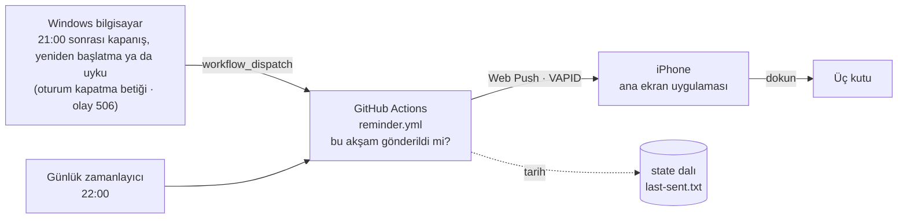

<div align="center">


# Akşam Notu

**Küçük bir akşam notu ve hatırlatma uygulaması. Bilgisayar gece kapanınca ya da uykuya geçince telefona, yatmadan önce üç satır yazmayı hatırlatan tek bir nazik bildirim gelir.**

*[İçgörü](https://github.com/YILDIRIMZX/Piskolojik-Destek-Uygulamas-)'nün yardımcı uygulamasıdır.*

[English](README.md) · **Türkçe** · [Русский](README.ru.md)


</div>

## Nedir

Akşam Notu, kısa bir akşam değerlendirmesini bir iki dakikalık bir alışkanlığa dönüştürür: yatmadan önce açıkta kalan problemi, yarın atılacak ilk adımı ve bugün "alarmın" (tekrarlayan öz eleştirel bir cümle) çalıp çalmadığını yazarsın. Ertesi sabah uygulama önce dün akşamki notu gösterir.

Bilerek sessiz tasarlandı. **Seri tutma, puan, uyarı ya da suçlayıcı mesaj yoktur.** Her kutu boş bırakılabilir. Hatırlatma **günde en fazla bir kez** gelir ve her bildirim gibi kapatılabilir.

> Her güncelleme, neyin neden değiştiğiyle birlikte [CHANGELOG.md](CHANGELOG.md) dosyasında yer alır.

## Hatırlatma nasıl çalışır



1. **Kapanış ve uyku tetikleyicisi.** Windows kapanışta her zaman bir olay yazmıyor ve kapanmadan önceki son saniye bir ağ isteği için çok kısa. Bu yüzden kapatma ve yeniden başlatmayı bir **oturum kapatma betiği** (yerel Grup İlkesi) yakalar: Windows onu her kapatma ve yeniden başlatmada çalıştırır ve bitmesini bekler. Uykuyu, açılıştan itibaren SYSTEM hesabıyla çalışan ve uyku olayını (Kernel-Power 506) dinleyen küçük bir **izleyici** yakalar. Modern Bekleme'de kullanıcı oturumundaki programlar uykunun ilk saniyelerinde dondurulur ve uyanışa kadar yeni program başlatılmaz; sistem süreçleri ise çalışmaya devam eder ve ağ bağlı kalır, bu yüzden istek bilgisayar uykuya dalarken gider. Olay, bilgisayarın neden uyuduğunu da yazar: kapak, güç ya da uyku düğmesi ve Başlat > Uyku sayılır; boşta kalınca ekranın kapanması sayılmaz. İzleyici için token'ın bir kopyası bilgisayara göre şifrelenip yalnızca SYSTEM ve yöneticilerin okuyabildiği bir klasörde tutulur. Saat 21:00'i geçtiyse betik GitHub API'sine tek bir istek atar (yaklaşık bir saniye) ve **bilgisayarın yerel saatini UTC farkıyla birlikte** gönderir (ör. `2026-10-09T23:19:30+03:00`). GitHub kararı isteğin ulaştığı ana göre değil bu saate göre verir ve 90 dakikadan eski bir isteği yok sayar.
2. **Tek gönderici.** Tüm hatırlatmaları tek bir GitHub Actions işi gönderir. İş, ayrı bir `state` dalında tutulan tarihe bakar ve yalnızca bu akşam henüz gönderilmediyse gönderir. Çalışmalar sırayla yürür, bu yüzden bir kapanış ile 22:00 çalışması asla ikisi birden göndermez.
3. **22:00 güvencesi.** İş zamanlanmış olarak da çalışır. 22:00'ye kadar hatırlatma gitmediyse (örneğin bilgisayar hiç açılmadıysa) gönderir. GitHub zamanlanmış işleri bazen saatlerce geç başlatabildiği için üç çalışma var (21:40, 22:00, 22:20) ve zamanlanmış bir çalışma yalnızca 22:00 ile 23:30 arasında gönderir. Daha geç başlayan çalışma hiçbir şey yapmaz; böylece hatırlatma asla gece yarısı gelmez.
4. **Doğrudan uygulamaya Web Push.** Bildirim, VAPID anahtarlarıyla imzalanmış standart bir Web Push mesajıdır. Dokununca not ekranı açılır. Bir akşam 05:00'e kadar sürer, yani 00:30'daki kapanış bir önceki güne sayılır.

## Özellikler

| Alan | Ne yapar |
|---|---|
| **Üç kutu** | Açıkta kalan problem · Yarın atacağım ilk adım · Bugün alarm çaldı mı (evet / hayır, isteğe bağlı cümleyle). Hepsi isteğe bağlı. |
| **Sabah görünümü** | 05:00 ile 17:00 arasında dün akşamki not en üstte gösterilir. |
| **Geçmiş** | Tüm notlar tarihe göre, en yenisi üstte. Boş kutular gösterilmez. |
| **Hatırlatma** | **Yatmadan önce üç satır** · Açıkta kalan problem, yarın atacağım ilk adım, bugün alarm çaldı mı? Akşam başına en fazla bir kez. |
| **Yedek ve silme** | Tek dokunuşla JSON dışa aktarma. Tüm notlar iki dokunuşluk onayla cihazdan silinebilir. |

## Gizlilik ve güvenlik

- **Notlar cihazdan çıkmaz.** Tarayıcının IndexedDB'sinde saklanır. Hiçbir yere, GitHub'a bile yüklenmez. Uygulama, notların depolama sıkışıklığında silinmemesi için tarayıcıdan kalıcı depolama ister.
- **Uygulama hiçbir yere veri gönderemez.** Yayınlanan sayfada yalnızca kendi adresine bağlantıya izin veren bir İçerik Güvenlik Politikası (CSP) vardır; üçüncü taraf betik, yazı tipi ya da analiz aracı yoktur. Hatalı bir bağımlılık bile notları başka bir sunucuya gönderemez. Bağlantılar yönlendiren bilgisi (referrer) olmadan açılır.
- **Kontrol sende.** Tüm notlar uygulamada iki dokunuşluk onayla silinebilir. Yedek dosyası şifresizdir, dikkatli sakla.
- **Hatırlatma kişisel veri taşımaz.** Bildirim içeriği `push.config.json` içindeki sabit bir cümledir. GitHub yalnızca son hatırlatmanın tarihini tutar.
- **Telefonuna yalnızca sen bildirim gönderebilirsin.** Göndermek için hem VAPID özel anahtarı hem telefonun aboneliği gerekir. İkisi de şifreli GitHub Actions gizli değerleridir: kayıtlarda asla görünmez, fork'lara ve pull request'lere açılmaz. İşi başlatmak için repoya yazma yetkisi gerekir. Bir bildirim yalnızca yazı gösterebilir, telefondan hiçbir şey okuyamaz.
- **Windows token'ı dar yetkilidir.** Yalnızca bu repoya ve Actions'a yetkili, ince ayarlı bir token'dır. Kullanıcının kendi profil klasöründe, yalnızca o Windows hesabının çözebileceği şekilde Windows DPAPI ile şifrelenmiş olarak saklanır. Oturum kapatma betiğinin kendisi yalnızca yöneticilerin değiştirebildiği bir klasördedir.
- **Herkese açık olan.** Herkese açık bir repoda hatırlatma işinin ne zaman çalıştığını herkes görebilir; bu da bilgisayarın kabaca ne zaman kapatıldığını gösterir. Kayıtlar yalnızca ne karar verildiğini yazar, kimin tetiklediğini asla. Zamanı da gizlemek için hatırlatma işi gizli (private) bir repodan çalıştırılabilir (ücretsiz Actions dakikaları yeter).
- **GitHub hesabını koru.** Hesabı ele geçiren biri uygulamanın kodunu değiştirebilir; iki adımlı doğrulamayı (2FA) aç.

## Kurulum

Bir GitHub hesabı, iOS 16.4 veya üstü bir iPhone (ya da Web Push destekleyen herhangi bir tarayıcı) ve kapanış tetikleyicisi için Windows 10 ya da 11 gerekir.

1. **Repo ve Pages.** Herkese açık bir repo oluştur, projeyi gönder, sonra **Settings > Pages > Source** ayarını **GitHub Actions** yap.
2. **VAPID anahtarları.** `npx web-push generate-vapid-keys` çalıştır. Açık anahtarı ve `sahip/repo` adını [`push.config.json`](push.config.json) dosyasına yaz; özel anahtarı **`VAPID_PRIVATE_KEY`** adlı Actions gizli değeri olarak kaydet (**Settings > Secrets and variables > Actions**).
3. **Telefon.** Siteyi Safari'de aç, **Paylaş > Ana Ekrana Ekle**'yi seç, uygulamayı ana ekrandan aç, **Bildirim**'e gir ve **Bildirimleri aç**'a dokun. Gösterilen kodu kopyalayıp **`PUSH_SUBSCRIPTIONS`** gizli değeri olarak kaydet. Birden fazla cihaz için kodları bir JSON dizisinde birleştir.
4. **Token.** Yalnızca bu repoya erişimi olan ve **Actions: Read and write** iznine sahip bir [ince ayarlı kişisel erişim token'ı](https://github.com/settings/personal-access-tokens/new) oluştur.
5. **Windows.** `pc\kur.ps1` dosyasını çalıştır (yönetici izni ister; yönetici, kullandığın hesabın kendisi olmalı), sorulunca token'ı yapıştır ve bir test bildirimi gönder. Önceki bir kurulumu da yükseltir ve token'ını korur. `pc\kaldir.ps1` her şeyi geri kaldırır.
6. **İsteğe bağlı.** 21:00'i değiştirmek için `START_HOUR` adlı Actions değişkenini ayarla. İstediğin an hatırlatma göndermek için **Actions > Evening reminder > Run workflow**'u "test" işaretli başlatabilirsin.

## Teknoloji

| Katman | Teknoloji | Sürüm |
|---|---|---|
| Arayüz | React | 19.3 |
| Dil | TypeScript | 6.0 |
| Derleme | Vite | 8.3 |
| Stil | Tailwind CSS (Vite eklentisi) | 4.3 |
| Simgeler | Phosphor Icons | 2.1 |
| Yazı tipi | Geist Variable (Fontsource ile yerel) | 5.3 |
| PWA | vite-plugin-pwa (Workbox, injectManifest) | 2.0 |
| Depolama | idb-keyval (IndexedDB) | 6.3 |
| Bildirim | Web Push API, `web-push` (VAPID) | 3.6 |
| Zamanlayıcı ve gönderici | GitHub Actions | |
| Kapanış tetikleyicisi | Windows Görev Zamanlayıcı, PowerShell 5.1 | |
| Barındırma | GitHub Pages | |

## Proje yapısı

```
src/
├── App.tsx                 Ekran geçişi, 05:00'te akşam değişimi
├── sw.ts                   Service worker: çevrimdışı önbellek, bildirim, dokunma
├── screens/
│   ├── Today.tsx           Dünkü not ve üç kutu
│   ├── History.tsx         Tarihe göre tüm notlar
│   ├── Settings.tsx        Bildirim kurulumu ve yedek
│   └── NoteView.tsx        Salt okunur not
└── lib/
    ├── notes.ts            Depolama, akşam tarihi mantığı, yedek
    └── push.ts             İzin, abonelik, deneme bildirimi
.github/
├── workflows/reminder.yml  Akşamda bir kez gönderen iş (kapanış, 22:00, elle)
├── workflows/deploy.yml    Derleyip Pages'e yayınlar
└── push/send.mjs           Web Push gönderici
pc/
├── kur.ps1                 Windows kurulumu (görev, şifreli token)
├── kapanis.ps1             Uyku izleyicisi (SYSTEM) ve oturum kapatma betiği; yerel saati GitHub'a gönderir